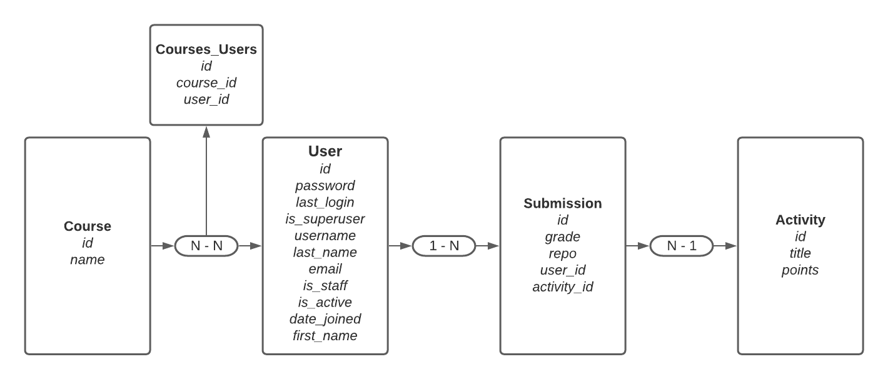

# KANVAS
um sistema voltado para o ensino. É possível cadastrar estudantes, facilitadores e instrutores, proporcionando aos estudantes cursos e atividades. Nesse sistema o aluno encontra aulas em formato escrito e por videos proporcionadas pelos instrutores e com auxilio dos facilitadores, atividades para praticar o que aprendeu para assimilar e é possível enviar essas atividades para a correção do time de ensino, recebendo depois todo o feedback sobre seu desempenho.

# Diagrama Entidade Relacionamento
</br>

</br>

## 1 - Como rodar o projeto ? entre no terminal e siga o passo a passo abaixo:

#### 1.1 - Faça o clone do repositório:
``` git clone git@gitlab.com:diogo__.py/kanvas.git ``` <br />
ou <br />
``` https://gitlab.com/diogo__.py/kanvas.git ``` 

#### 1.2 - entre no diretório do repositório clonado:
``` cd kanvas ``` 

#### 1.3 - crie um ambiente virtual:
``` python -m venv venv``` 

#### 1.4 - ative ambiente virtual (você sempre vai trabalhar nesse ambiente):
``` source venv/bin/activate``` 

#### 1.5 - uma vez dentro do ambiente virtual, instale as dependências:
``` pip install -r requirements.txt```

#### 1.6 - com os 2 próximos comandos, rode as migrations (para criar as tabelas no banco de dados interno):
``` python manage.py makemigrations ``` <br /><br />
```  python manage.py migrate ```

#### 1.7 - por fim, inicie o servidor para rodar o projeto:
``` python manage.py runserver ```
##### 1.7.1 - se todos os passos foram bem executados, seu projeto vai rodar localmente no seguinte endereço:
http://127.0.0.1:8000/


## 2 - Consumindo a API, segue abaixo todas as rotas/endpoints da aplicação

## 2.1 - USUÁRIO

### 2.1.1 - Cadatrar

#### POST - ```http://127.0.0.1:8000/api/accounts/```
```json
// BODY REQUEST
{
    
    "username": "student",
    "password": "1234",
    "is_superuser": false,
    "is_staff": false
}
    
```

```json
// RESPONSE STATUS -> HTTP 201
{
    "id": 1,
    "username": "student",
    "is_superuser": false,
    "is_staff": false
}
```
### 2.1.1.1 - Excessão ao cadatrar usuário que já existe

```json
// RESPONSE STATUS -> HTTP 409 - Conflict
{
    "error": "user already exists"
}
```

### 2.1.2 - Login

#### POST - ```http://127.0.0.1:8000/api/login/```
```json
// BODY REQUEST
{
    "username": "student",
    "password": "1234"
}
    
```

```json
// RESPONSE STATUS -> HTTP 200
{
    "token": "dfd384673e9127213de6116ca33257ce4aa203cf"
}
```

## 2.1.2.1 - Excesssões ao realizar login e de operações não autorizadas de acordo com o nível de usúario.

### 2.1.2.1.1  - Realizar login em uma conta ainda não criada
```json
// RESPONSE STATUS -> HTTP 401 - Unauthorized
{
    "error": "Incorrect login or password"
}
```

### 2.1.2.1.2  - Token inválido
```json
// RESPONSE STATUS -> HTTP 401
{
    "error": "Invalid token"
}
```
### 2.1.2.1.3  - Token válido, porém não atende os requisitos mínimo de permissão
```json
// RESPONSE STATUS -> HTTP 403
{
    "error": "You do not have permission to perform this action."
}
```

## 2.2 - CURSO

### 2.2.1 - Cadastrar (somente instrutor )

#### POST - ```http://127.0.0.1:8000/api/courses/```
```json
// BODY REQUEST
{
    "name": "Node"
}
    
```

```json
// RESPONSE STATUS -> HTTP 201
{
    "id": 1,
    "name": "Node",
    "users": []
}
```

## 2.2.1.1 - Excesssão ao cadastrar um curso que já existe
```json
// RESPONSE STATUS -> HTTP 400 BAD REQUEST
{
    "error": "Course with this name already exists"
}
```


### 2.2.2 - Listar cursos e alunos matriculdos
#### GET - ```http://127.0.0.1:8000/api/courses/```

```json
// RESPONSE STATUS -> HTTP 200
[
    {
        "id": 1,
        "name": "Node",
        "users": [
            {
                "id": 3,
                "username": "student1"
            }
        ]
    },
    {
        "id": 2,
        "name": "Django",
        "users": []
    },
    {
        "id": 3,
        "name": "React",
        "users": []
    }
]
```


### 2.2.3 - Exibir curso por ID

#### GET - ```http://127.0.0.1:8000/api/courses/<int:course_id>/```

```json
// RESPONSE STATUS -> HTTP 200
{
    "id": 1,
    "name": "Node",
    "users": [
        {
            "id": 3,
            "username": "student1"
        }
    ]
}
```

### 2.2.4 - Editar (somente instrutor)

#### PUT - ```http://127.0.0.1:8000/api/courses/<int:course_id>/```
```json
// BODY REQUEST
{
    "name": "Python Django"
}
    
```

```json
// RESPONSE STATUS -> HTTP 200
{
    "id": 1,
    "name": "Python Django",
    "users": []
}
```

### 2.2.5 - Excluir (somente instrutor)

#### DELETE - ```http://127.0.0.1:8000/api/courses/<int:course_id>/```
```json
 // RESPONSE STATUS -> HTTP 204 NO CONTENT
```

## 2.2.6 - Excessões de exbir, editar e exclir curso por ID inexistente
```json
// RESPONSE STATUS -> HTTP 404 Not Found
{
   "error": "course does not exist"
}
```

### 2.2.7 - Vincular os alunos ao curso (somente instrutor)

#### PUT - ```http://127.0.0.1:8000/api/courses/<int:course_id>/registrations/```
```json
// BODY REQUEST
{
    "user_ids": [3, 4, 5]
}
    
```


```json
// RESPONSE STATUS -> HTTP 200
{
    "id": 1,
    "name": "Node",
    "users": [
        {
        "id": 3,
        "username": "student1"
        },
        {
        "id": 4,
        "username": "student2"
        },
        {
        "id": 5,
        "username": "student3"
        }
    ]
}
```

## 2.2.7.1 - Excesssões em vincular os alunos ao curso

### 2.2.7.1.1 - Caso não seja informado uma lista de estudantes
```json
// RESPONSE STATUS -> HTTP 400 - Bad request
{
   "error": "you need to enter a list of students"
}
```

### 2.2.7.1.2 - Somente estudantes podem ser matriculados, caso contrário:
```json
// RESPONSE STATUS -> HTTP 400 - Bad request
{
   "error": "Only students can be enrolled in the course"
}
```

### 2.2.7.1.3 - Caso seja informado na lista um ID de usário inválido:
```json
// RESPONSE STATUS -> HTTP 404 - Not Found
{
    "errors": "invalid user_id list"
}
```

## 2.3 - ATIVIDADES E SUBMISSÕES

### 2.3.1 - Criar atividade (somente instrutor ou facilitador )

#### POST - ```http://127.0.0.1:8000/api/activities/```
```json
// BODY REQUEST
{
    "title": "Kenzie Pet",
    "points": 10
}
    
```


```json
// RESPONSE STATUS -> HTTP 201
{
    "id": 1,
    "title": "Kenzie Pet",
    "points": 10,
    "submissions": []
}
```

### 2.3.1.1 - Excessão de criar atividade com o mesmo titulo

```json
// RESPONSE STATUS -> HTTP 400 BAD REQUEST
{
    "error": "Activity with this name already exists"}
}
```


### 2.3.2 - Listar atividades com suas submissões (somente instrutor ou facilitador)

#### GET - ```http://127.0.0.1:8000/api/activities/```

```json
// RESPONSE STATUS -> HTTP 200
[
    {
        "id": 1,
        "title": "Kenzie Pet",
        "points": 10,
        "submissions": [
            {
                "id": 1,
                "grade": 10,
                "repo": "http://gitlab.com/kenzie_pet",
                "user_id": 3,
                "activity_id": 1
            }
        ]
    },
    {
        "id": 2,
        "title": "Kanvas",
        "points": 10,
        "submissions": [
            {
                "id": 2,
                "grade": 8,
                "repo": "http://gitlab.com/kanvas",
                "user_id": 4,
                "activity_id": 2
            }
        ]
    }
]
```


### 2.3.3 - Editar atividade (somente instrutor ou facilitador)

#### PUT - ```http://127.0.0.1:8000/api/activities/<int:activity_id>/```
```json
// BODY REQUEST
{
    "title": "Kenzie DOGS",
    "points": 30
}
    
```

```json
// RESPONSE STATUS -> HTTP 200
{
    "id": 1,
    "title": "Kenzie DOGS",
    "points": 30,
    "submissions": []
}
```

## 2.3.3.1 - Excessão onde a atividade que algum aluno tenha feito uma submissão não pode sofrer alteração no nome ou na pontuação
```json
// RESPONSE STATUS -> HTTP 400 Bad Request
{
   "error": "You can not change an Activity with submissions"
}
```


### 2.3.4 - Submeter (somente estudante)

#### POST - ```http://127.0.0.1:8000/api/activities/<int:activity_id>/submissions/```
```json
// BODY REQUEST
{
    "grade": 10, // Esse campo é opcional
    "repo": "http://gitlab.com/kenzie_pet"
}
    
```

```json
// RESPONSE STATUS -> HTTP 201
{
    "id": 7,
    "grade": null,
    "repo": "http://gitlab.com/kenzie_pet",
    "user_id": 3,
    "activity_id": 1
}
```


### 2.3.5 - Editar nota da atividade (somente instrutor ou facilitador)

#### PUT - ```http://127.0.0.1:8000/api/submissions/<int:submission_id>/```
```json
// BODY REQUEST
{
    "grade": 10
}
    
```


```json
// RESPONSE STATUS -> HTTP 200
{
    "id": 3,
    "grade": 10,
    "repo": "http://gitlab.com/kenzie_pet",
    "user_id": 3,
    "activity_id": 1
}
```


### 2.3.6 - Listar as submissões (estudante só pode ver as próprias submissões, enquanto facilitador ou instrutor pode ver todas) 

#### GET - ```http://127.0.0.1:8000/api/submissions/```

#### 2.3.6.1 - COMO ESTUDANTES PARA VER APENAS SUAS SUBMISSÕES:

```json
// RESPONSE STATUS -> HTTP 200
[
    {
        "id": 2,
        "grade": 8,
        "repo": "http://gitlab.com/kanvas",
        "user_id": 4,
        "activity_id": 2
    },
    {
        "id": 5,
        "grade": null,
        "repo": "http://gitlab.com/kmdb2",
        "user_id": 4,
        "activity_id": 1
    }
]
```

#### 2.3.6.2 - COMO INSTRUTORES OU FACILITADORES PARA VER TODAS AS SUBMISSÕES:

#### GET - ```http://127.0.0.1:8000/api/submissions/```
```json
// RESPONSE STATUS -> HTTP 200
[
    {
        "id": 1,
        "grade": 10,
        "repo": "http://gitlab.com/kenzie_pet",
        "user_id": 3,
        "activity_id": 1
    },
    {
        "id": 2,
        "grade": 8,
        "repo": "http://gitlab.com/kanvas",
        "user_id": 4,
        "activity_id": 2
    },
    {
        "id": 3,
        "grade": 4,
        "repo": "http://gitlab.com/kmdb",
        "user_id": 5,
        "activity_id": 3
    },
    {
        "id": 4,
        "grade": null,
        "repo": "http://gitlab.com/kmdb2",
        "user_id": 5,
        "activity_id": 3
    }
]
```

